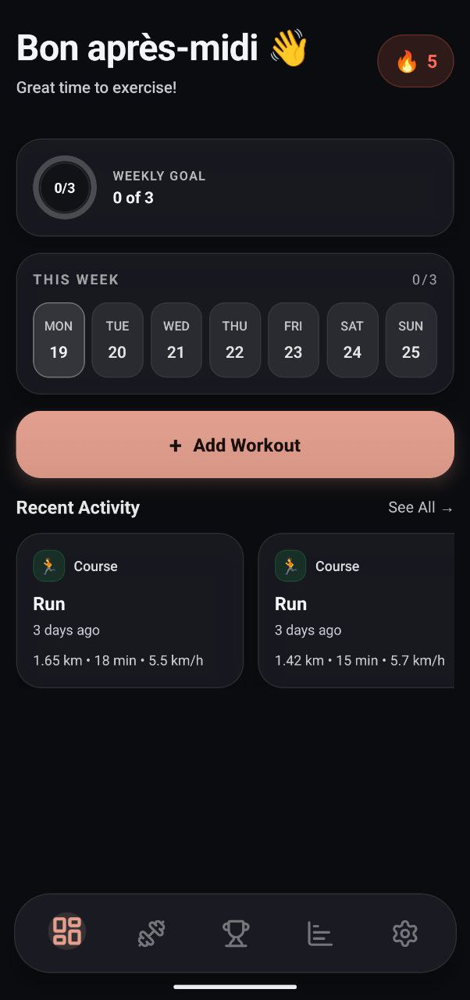
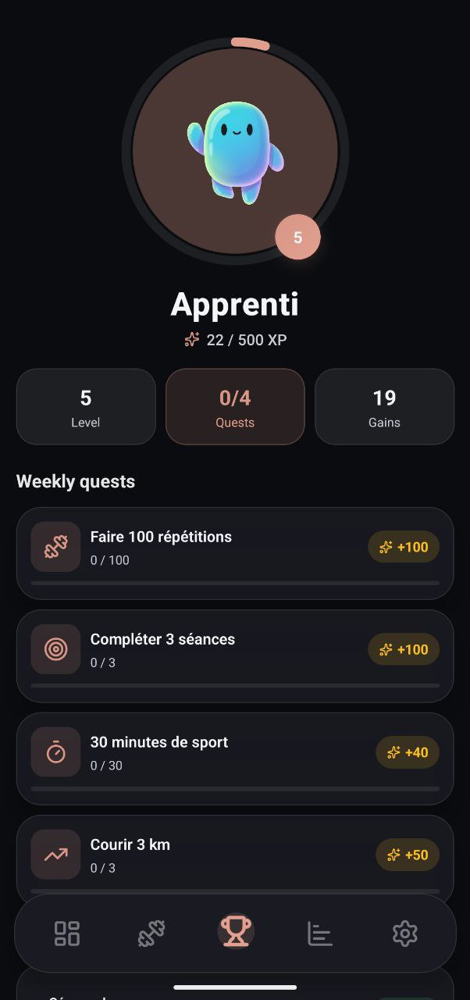
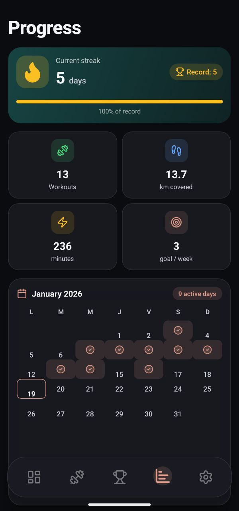
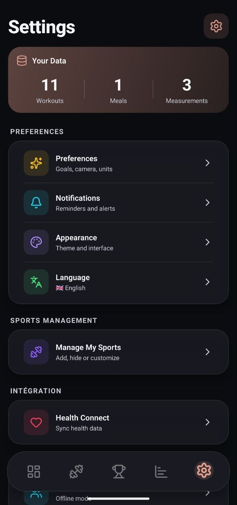
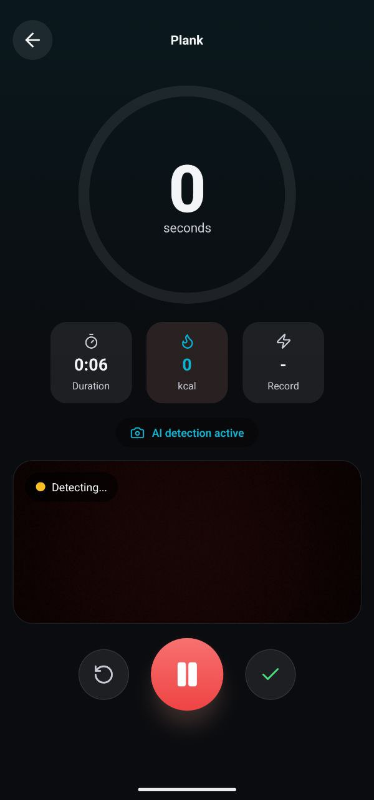

# 🏋️‍♂️ Spix

> **Your elegant, privacy‑first fitness companion.**
>
> *Built with React Native 0.81, Expo & TypeScript.*

**Spix** is a modern fitness tracking app built on a simple philosophy: **your data belongs to you**. It blends a slick dark *glassmorphism* UI with motivating gamification and advanced features (Health Connect, AI Rep Counter) while working fully **offline**.

---

## Screenshots 
|  |  |  |  |  |
|---|---|---|---|---|

---

## 🔒 Privacy & "Clean App" Philosophy

Because your health data should be yours alone, Spix was designed to be completely transparent:

- **🏠 100% Local & Offline**: The app works without internet. All data is stored on your device.
- **📷 Secure Camera**: The camera used for the *Rep Counter* only performs real‑time motion detection. **No images are recorded or sent to a server.**
- **🛡️ Accelerometer Alternative**: Concerned about privacy? A "Sensors‑only" mode counts reps without ever enabling the camera.
- **👻 Social (Optional)**: Social features are opt‑in and still in beta. If you make an account you stay in control.
- **🗑️ Total Deletion**: A single "Delete Account" button instantly removes your account and all associated data.
- **💸 No data selling**: Ever. This is a passion project, not a commercial product.

---

## 📱 Main Features

### 🎯 Dashboard & Tracking
- **Today Screen**: Compact summary with weekly progress ring and calendar.
- **Full Tracking**: Four dedicated modes (Home, Run, Meals, Measurements).
- **History**: Complete log with filters and quick delete.
- **Health Connect (Android)**: Smart automatic import of sessions from other apps.

### 🤖 Smart Rep Counter
Set your phone down and let the AI do the work:
- **Detection**: Analysis via camera (local pose detection) or accelerometer.
- **Exercises**: Supports push‑ups, squats, sit‑ups, jumping jacks.
- **Feedback**: Smooth animations and visual coaching.

### ⚡ Tools & Gamification
- **Workout Generator**: Build custom sessions (duration, focus, intensity).
- **Streak System**: Keep your streak alive to unlock visual rewards.
- **Badges**: Over 10 trophies to earn (from "First Step" to "Legend").
- **Stats**: Interactive charts to visualize your progress (weight, activity).

---

## 🔮 Project Status

⚠️ Note: This app was originally developed for personal use and is still in beta. Some features may be incomplete or unstable. Your feedback is invaluable! Contributions and suggestions are welcome via GitHub issues or PRs.

---

Built with ❤️, whey and zero ad trackers by Lucky 💪
